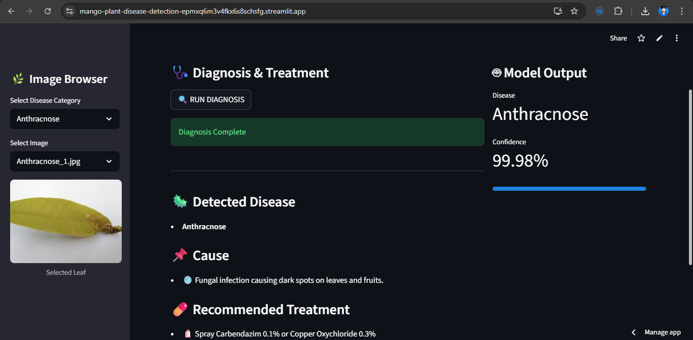
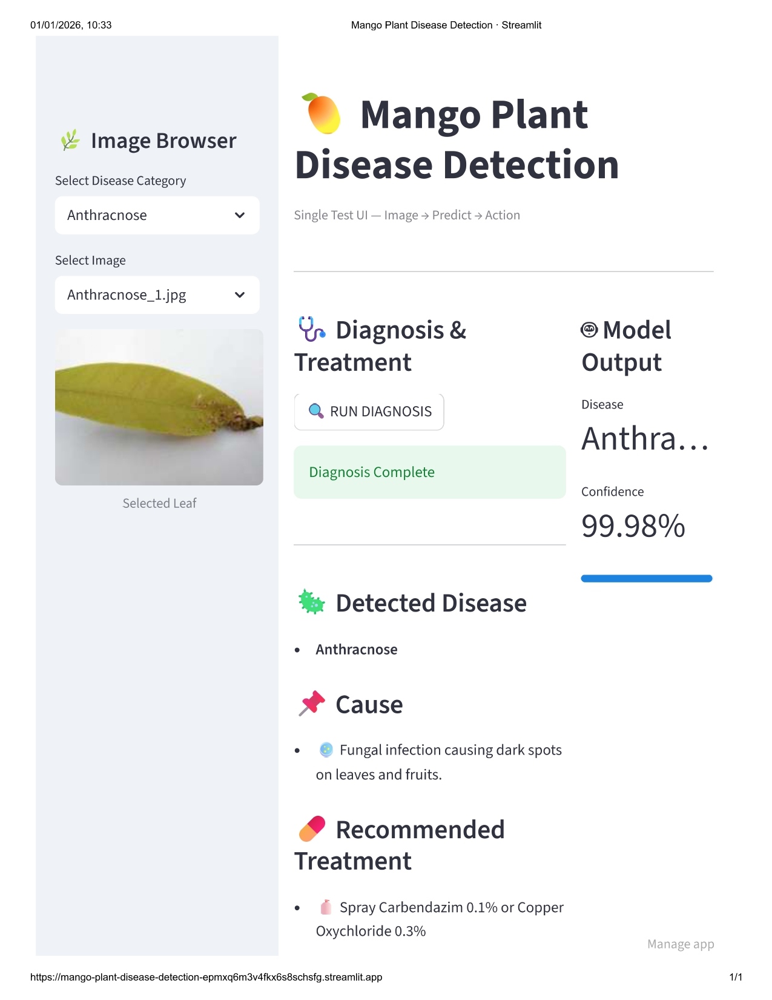

# 🥭 Mango Plant Disease Detection

An end-to-end AI-based Mango Leaf Disease Detection system that identifies plant diseases from leaf images and provides diagnosis confidence along with treatment recommendations using a trained deep learning pipeline.

---

### LIVE APP -
https://mango-plant-disease-detection-epmxq6m3v4fkx6s8schsfg.streamlit.app/

Project Snap Shot





---

## 🚀 Features

- 🌿 Detects 8 Mango plant conditions  
  - Anthracnose  
  - Bacterial Canker  
  - Cutting Weevil  
  - Die Back  
  - Gall Midge  
  - Powdery Mildew  
  - Sooty Mould  
  - Healthy  
- 🧠 Feature extraction using EfficientNet-B4  
- 🎯 Classification using Support Vector Machine (SVM)  
- 🛡️ Centroid-based similarity for fallback and open-set reasoning  
- 💊 Treatment and pesticide recommendations  
- 🖥️ Clean and interactive Streamlit UI  
- 📊 High accuracy (~99%)

---


## 🧩 Project Structure

```
Mango_Plant_Diseases_Detection/
│
├── app/
│   ├── __init__.py
│   ├── config.py              # Paths and constants
│   └── inference.py           # Model loading and prediction logic
│
├── data/                      # Dataset (class-wise folders)
│   ├── Anthracnose/
│   ├── Bacterial_Canker/
│   ├── Healthy/
│   └── ...
│
├── embeddings_cache/
│   ├── X_emb.npy              # Image embeddings
│   ├── y_lbl.npy              # Labels
│   ├── centroids.npy          # Class centroids
│   ├── classes.npy            # Class names
│   └── svc_model.pkl          # Trained SVM model
│
├── reports/
│   ├── class_balance_report.csv
│   ├── class_distribution.png
│   ├── predictions_results.csv
│   └── predictions_summary.csv
│
├── src.ipynb                  # Training and experimentation notebook
├── streamlit_app.py           # Main Streamlit application
├── requirements.txt
└── README.md
```

---

## 🧠 Model Pipeline

1. Image Input  
2. EfficientNet-B4 → Feature Extraction  
3. SVM Classifier → Disease Prediction  
4. Confidence Score Computation  
5. Treatment Recommendation  

Centroid similarity is used as a lightweight backup mechanism and for reasoning in uncertain or open-set cases.

---

## 🖥️ User Interface Overview

- Sidebar  
  - Disease category selection  
  - Image selection  
  - Leaf preview  

- Diagnosis & Treatment (Center Panel)  
  - Run diagnosis  
  - Detected disease  
  - Cause description  
  - Treatment and pesticide suggestions  

- Model Output (Right Panel)  
  - Predicted disease  
  - Confidence score  
  - Visual confidence bar  

---

## ▶️ How to Run Locally

### Step 1: Create virtual environment
```
python -m venv .venv
```

Activate it:

Windows:
```
.venv\Scripts\activate
```

Linux / macOS:
```
source .venv/bin/activate
```

### Step 2: Install dependencies
```
pip install -r requirements.txt
```

### Step 3: Run the app
```
streamlit run streamlit_app.py
```

---

## 📌 Notes

- This project is intended for academic and learning purposes.
- Treatment suggestions are indicative; consult an agriculture expert before real-world use.

---

## 👨‍💻 Author

Karan Tatyaso Kamble  
AI / Data Science Project
